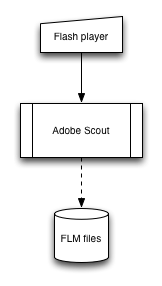
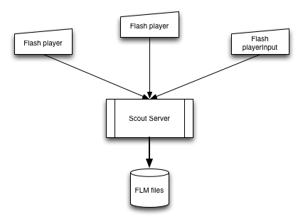

scout-server
============

A headless socket server to record FLM telemetry from Flash players, in place of a live Adobe Scout instance.

Recent version of Flash Player provide the means of streaming telemetry to a remote running Adobe Scout, as is detailed on Adobe's "[Getting started with Adobe Scout](http://www.adobe.com/devnet/scout/articles/adobe-scout-getting-started.html#articlecontentAdobe_numberedheader_3)". 

Scout-server is intended for circumstances where running Scout continuously is impractical. It is little more than a TCP socket server that saves any content streamed to it. Before saving a file it will assert that any content bears the FLM 'magic numbers' 0x0A, 0x23, 0x0D and 0x2E. 

Building
--------

    mvn clean install

Running
-------

    java -jar target/uber-scout-server-1.0-SNAPSHOT.jar

Options:

 * -p server port number, defaults to 7934
 * -d Optional output directory, defaults to current directory.
 

Ensure that any remote Flash players from which telemetry is required have a configured `.telemetry.cfg` file. When the server starts reminds you of this need, and suggests an example content:

    2014/09/04 18:19:49 INFO Server - Remember to set the configuration file on monitored hosts, for example
    TelemetryAddress=192.168.59.31:7934
    SamplerEnabled = true
    CPUCapture = true
    DisplayObjectCapture = true
    Stage3DCapture = true

Output filenames bear the IP address of the Flash Player,  the connection timestamp and a sequence number e.g.

    192_168_59_31__2014_09_04_11_48_43__2.flm
    
This holds FLM data from Flash Player on 192.168.59.31 at 11:48:43 this morning and it was the 2nd file recorded.  

To do
-----
1. Unit tests
2. JMX instrumentation